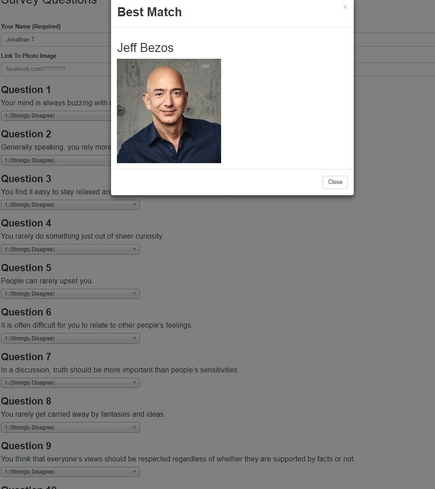
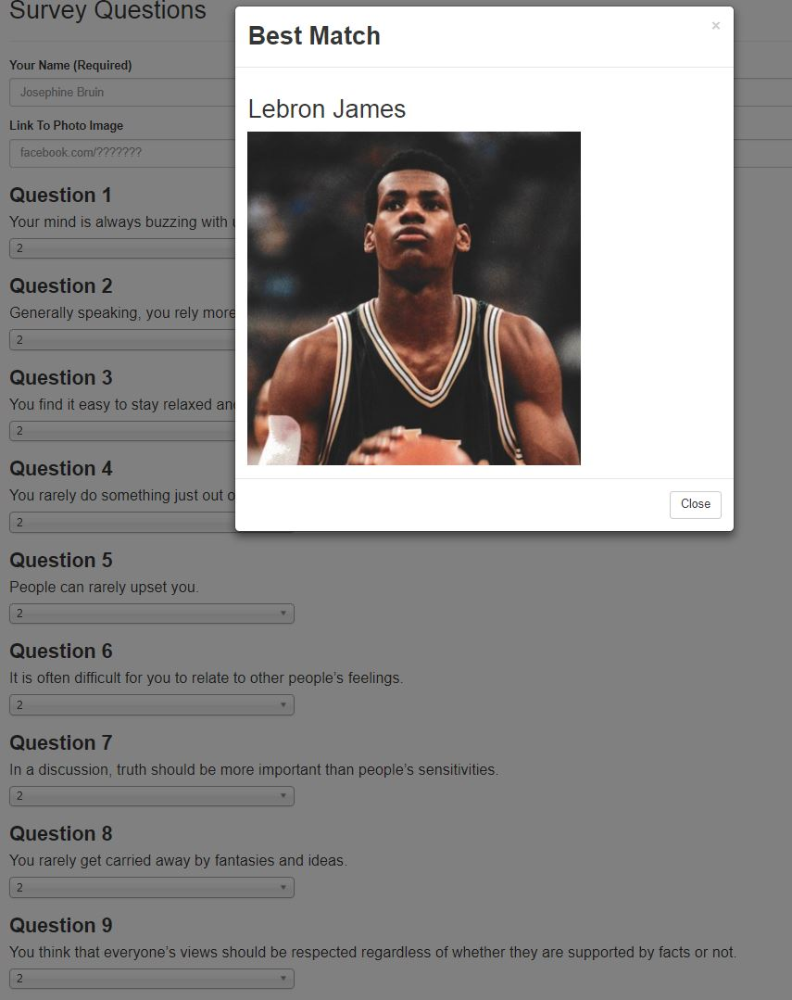

# friendFinder

Celebrity Finder is an application that will smartly recommend you a celebrity to begin to idolize that will depend on how you respond to a survey that is given to you. (Spoiler alert, it doesn't have the most accurate friend algorithm.)

## Getting Started

This application uses 3 node modules

1. chosen-js
2. express
2. path

These modules are included as dependencies in the original node module. Be sure to either run

```
npm i
```

or
```
npm i chosen-js
npm i express
npm i path
```

before beginning.

## Getting to the Survey.
1. Click the Survey Button to head to the survey and begin matching with your dream celebrity. 
2. The more consistent your answers are towards a certain response (more likely to input 1 -Strongly Disagree) the more consistent you are to be matched with a certain celebrity.
3. Have Fun!

## Examples


If you are likely to disagree with every prompt (i.e put 1 everywhere), you will most likely be matched with Jeff Bezos.


If you are more likely to be agreeable(i.e put 2 everywhere), you will most likely be matched with Lebron James.



## Live Deployment

https://jtalafriendfinder.herokuapp.com/


## Developers
Jonathan Talavera github: @jtala